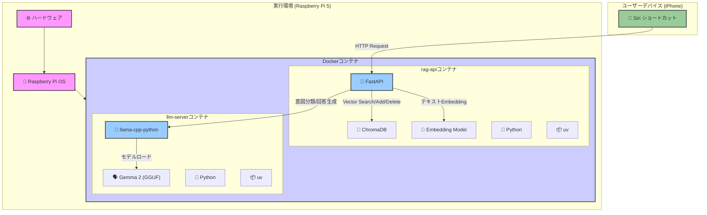

```mermaid
graph TD
    subgraph "ユーザーデバイス (iPhone)"
        UI[📱 Siri ショートカット]
    end

    subgraph "実行環境 (Raspberry Pi 5)"
        HW[⚙️ ハードウェア] --> OS[🐧 Raspberry Pi OS]
        OS --> DKR[🐳 Docker / Docker Compose]

        subgraph DKR [Dockerコンテナ]
            subgraph "rag-apiコンテナ"
                direction LR
                FAPI[🚀 FastAPI];
                CHRM[💾 ChromaDB];
                EMB[🧬 Embedding Model];
                PY1[🐍 Python];
                UV1[📦 uv];
            end

            subgraph "llm-serverコンテナ"
                direction LR
                LCPP[🧠 llama-cpp-python];
                LLM["🗣️ Gemma 2 (GGUF)"];  
                PY2[🐍 Python];
                UV2[📦 uv];
            end
        end
    end

    UI -- HTTP Request --> FAPI;
    FAPI -- 意図分類/回答生成 --> LCPP;
    FAPI -- Vector Search/Add/Delete --> CHRM;
    FAPI -- テキストEmbedding --> EMB;
    LCPP -- モデルロード --> LLM;

    %% スタイル (オプション)
    style HW fill:#f9f,stroke:#333,stroke-width:2px
    style OS fill:#f9f,stroke:#333,stroke-width:2px
    style DKR fill:#ccf,stroke:#333,stroke-width:2px
    style FAPI fill:#9cf,stroke:#333,stroke-width:2px
    style LCPP fill:#9cf,stroke:#333,stroke-width:2px
    style UI fill:#9c9,stroke:#333,stroke-width:2px
```