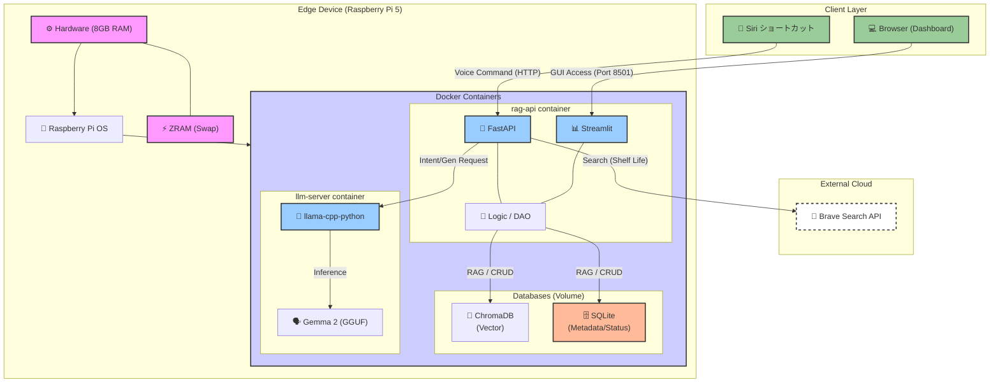

```mermaid
graph TD
    subgraph "Client Layer"
        UI_VOICE["📱 Siri ショートカット"]
        UI_WEB["💻 Browser (Dashboard)"]
    end

    subgraph "External Cloud"
        BRAVE["🦁 Brave Search API"]
    end

    subgraph "Edge Device (Raspberry Pi 5)"
        HW["⚙️ Hardware (8GB RAM)"]
        ZRAM["⚡ ZRAM (Swap)"]
        HW --- ZRAM
        OS["🐧 Raspberry Pi OS"]
        HW --> OS
        OS --> DKR["🐳 Docker / Docker Compose"]

        subgraph DKR [Docker Containers]
            
            subgraph "rag-api container"
                direction TB
                FAPI["🚀 FastAPI"]
                STRM["📊 Streamlit"]
                PY1["🐍 Logic / DAO"]
            end

            subgraph "Databases (Volume)"
                CHRM["💾 ChromaDB\n(Vector)"]
                SQL["🗄️ SQLite\n(Metadata/Status)"]
            end

            subgraph "llm-server container"
                direction TB
                LCPP["🧠 llama-cpp-python"]
                LLM["🗣️ Gemma 2 (GGUF)"]
            end
        end
    end

    %% Data Flow
    UI_VOICE -- "Voice Command (HTTP)" --> FAPI
    UI_WEB -- "GUI Access (Port 8501)" --> STRM

    FAPI -- "Intent/Gen Request" --> LCPP
    LCPP -- "Inference" --> LLM

    %% Logic Connections
    FAPI -- "Search (Shelf Life)" --> BRAVE
    FAPI & STRM --- PY1
    PY1 -- "RAG / CRUD" --> CHRM & SQL

    %% Styling
    style HW fill:#f9f,stroke:#333,stroke-width:2px
    style ZRAM fill:#f9f,stroke:#333,stroke-width:2px
    style DKR fill:#ccf,stroke:#333,stroke-width:2px
    style BRAVE fill:#fff,stroke:#333,stroke-width:2px,stroke-dasharray: 5 5
    style FAPI fill:#9cf,stroke:#333,stroke-width:2px
    style STRM fill:#9cf,stroke:#333,stroke-width:2px
    style LCPP fill:#9cf,stroke:#333,stroke-width:2px
    style UI_VOICE fill:#9c9,stroke:#333,stroke-width:2px
    style UI_WEB fill:#9c9,stroke:#333,stroke-width:2px
    style SQL fill:#fb9,stroke:#333,stroke-width:2px
```