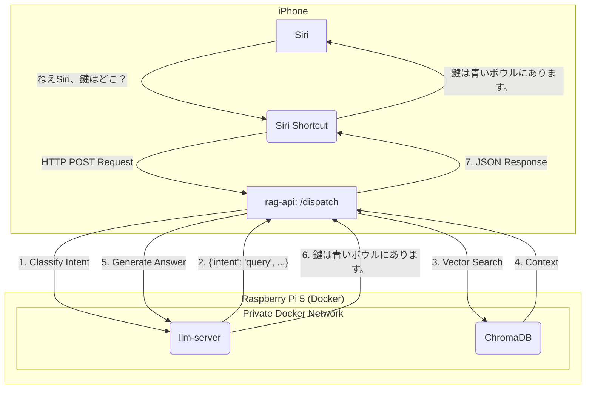

```mermaid
graph TD
    subgraph iPhone
        A[Siri] -- "ねえSiri、鍵はどこ？" --> B(Siri Shortcut)
        B -- HTTP POST Request --> E[rag-api: /dispatch]
    end

    subgraph "Raspberry Pi 5 (Docker)"
        subgraph "Private Docker Network"
            E -- 1. Classify Intent --> F(llm-server)
            F -- "2. {'intent': 'query', ...}" --> E  
            E -- 3. Vector Search --> G(ChromaDB)
            G -- 4. Context --> E
            E -- 5. Generate Answer --> F
            F -- "6. 鍵は青いボウルにあります。" --> E
        end
    end
    
    E -- 7. JSON Response --> B
    B -- "鍵は青いボウルにあります。" --> A
```