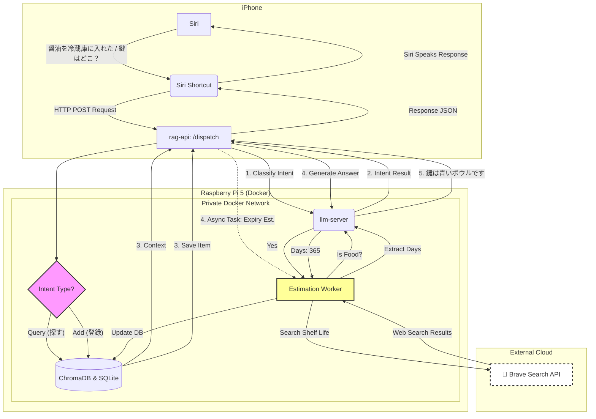

```mermaid
graph TD
    subgraph iPhone
        A[Siri] -- "醤油を冷蔵庫に入れた / 鍵はどこ？" --> B(Siri Shortcut)
        B -- HTTP POST Request --> E[rag-api: /dispatch]
    end

    subgraph "External Cloud"
        BS[🦁 Brave Search API]
    end

    subgraph "Raspberry Pi 5 (Docker)"
        subgraph "Private Docker Network"

            %% Common Step: Intent Classification
            E -- 1. Classify Intent --> F(llm-server)
            F -- "2. Intent Result" --> E

            E --> DECISION{Intent Type?}

            %% Flow A: Query (Search)
            DECISION -- "Query (探す)" --> G[(ChromaDB & SQLite)]
            G -- 3. Context --> E
            E -- 4. Generate Answer --> F
            F -- "5. 鍵は青いボウルです" --> E

            %% Flow B: Add (Register & Estimate)
            DECISION -- "Add (登録)" --> G
            G -- 3. Save Item --> E

            %% Background Task (Async)
            E -. "4. Async Task: Expiry Est." .-> EST[Estimation Worker]
            EST -- "Is Food?" --> F
            F -- "Yes" --> EST
            EST -- "Search Shelf Life" --> BS
            BS -- "Web Search Results" --> EST
            EST -- "Extract Days" --> F
            F -- "Days: 365" --> EST
            EST -- "Update DB" --> G
        end
    end

    %% Final Response to User
    E -- Response JSON --> B
    B -- "Siri Speaks Response" --> A

    %% Styling
    style BS fill:#fff,stroke:#333,stroke-width:2px,stroke-dasharray: 5 5
    style EST fill:#ff9,stroke:#333,stroke-width:2px
    style DECISION fill:#f9f,stroke:#333,stroke-width:2px
```
