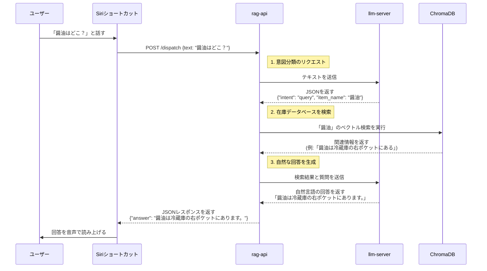

```mermaid
sequenceDiagram
    participant ユーザー
    participant Siriショートカット
    participant rag-api
    participant llm-server
    participant ChromaDB

    ユーザー->>Siriショートカット: 「醤油はどこ？」と話す
    Siriショートカット->>rag-api: POST /dispatch {text: "醤油はどこ？"}
    
    Note right of rag-api: 1. 意図分類のリクエスト
    rag-api->>llm-server: テキストを送信
    llm-server-->>rag-api: JSONを返す<br>{"intent": "query", "item_name": "醤油"}

    Note right of rag-api: 2. 在庫データベースを検索
    rag-api->>ChromaDB: 「醤油」のベクトル検索を実行
    ChromaDB-->>rag-api: 関連情報を返す<br>(例:「醤油は冷蔵庫の右ポケットにある」)

    Note right of rag-api: 3. 自然な回答を生成
    rag-api->>llm-server: 検索結果と質問を送信
    llm-server-->>rag-api: 自然言語の回答を返す<br>「醤油は冷蔵庫の右ポケットにあります。」

    rag-api-->>Siriショートカット: JSONレスポンスを返す<br>{"answer": "醤油は冷蔵庫の右ポケットにあります。"}
    Siriショートカット->>ユーザー: 回答を音声で読み上げる
```