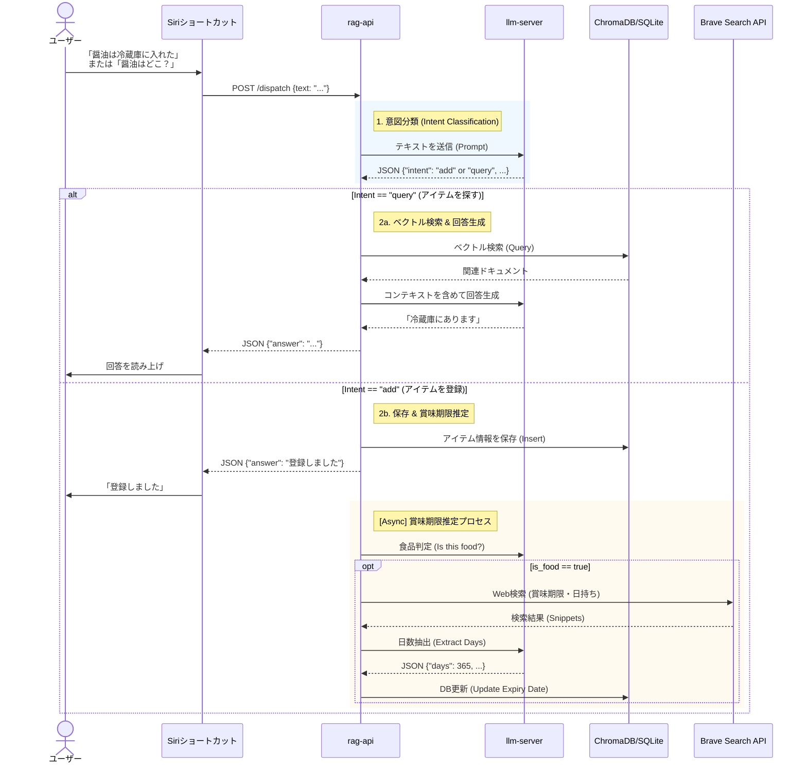

```mermaid
sequenceDiagram
    actor User as ユーザー
    participant Siri as Siriショートカット
    participant API as rag-api
    participant LLM as llm-server
    participant DB as ChromaDB/SQLite
    participant Brave as Brave Search API

    User->>Siri: 「醤油は冷蔵庫に入れた」<br>または「醤油はどこ？」
    Siri->>API: POST /dispatch {text: "..."}
    
    %% 1. 意図分類
    rect rgb(240, 248, 255)
    Note right of API: 1. 意図分類 (Intent Classification)
    API->>LLM: テキストを送信 (Prompt)
    LLM-->>API: JSON {"intent": "add" or "query", ...}
    end

    alt Intent == "query" (アイテムを探す)
        Note right of API: 2a. ベクトル検索 & 回答生成
        API->>DB: ベクトル検索 (Query)
        DB-->>API: 関連ドキュメント
        API->>LLM: コンテキストを含めて回答生成
        LLM-->>API: 「冷蔵庫にあります」
        API-->>Siri: JSON {"answer": "..."}
        Siri->>User: 回答を読み上げ

    else Intent == "add" (アイテムを登録)
        Note right of API: 2b. 保存 & 賞味期限推定
        API->>DB: アイテム情報を保存 (Insert)
        
        %% ユーザーへのレスポンスは先に返す (高速化)
        API-->>Siri: JSON {"answer": "登録しました"}
        Siri->>User: 「登録しました」

        %% 非同期処理 (Background Task)
        rect rgb(255, 250, 240)
        Note right of API: [Async] 賞味期限推定プロセス
        API->>LLM: 食品判定 (Is this food?)
        
        opt is_food == true
            API->>Brave: Web検索 (賞味期限・日持ち)
            Brave-->>API: 検索結果 (Snippets)
            API->>LLM: 日数抽出 (Extract Days)
            LLM-->>API: JSON {"days": 365, ...}
            API->>DB: DB更新 (Update Expiry Date)
        end
        end
    end
```