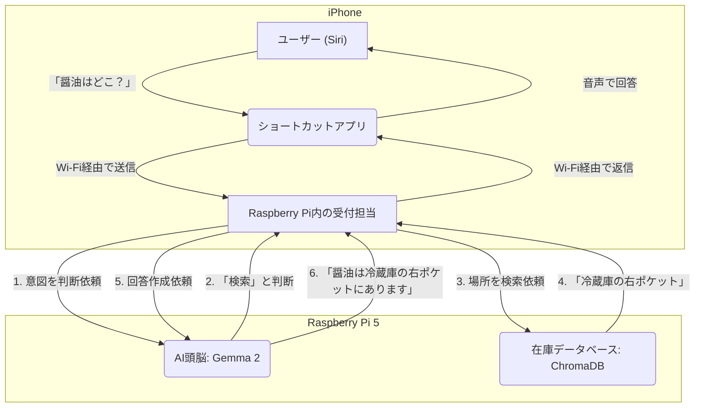

```mermaid
graph TD
    subgraph iPhone
        A["ユーザー (Siri)"] -- 「醤油はどこ？」 --> B(ショートカットアプリ);
        B -- Wi-Fi経由で送信 --> C[Raspberry Pi内の受付担当];
    end

    subgraph "Raspberry Pi 5"
       C -- 1. 意図を判断依頼 --> D(AI頭脳: Gemma 2);
       D -- 2. 「検索」と判断 --> C;
       C -- 3. 場所を検索依頼 --> E(在庫データベース: ChromaDB);
       E -- 4. 「冷蔵庫の右ポケット」 --> C;
       C -- 5. 回答作成依頼 --> D;
       D -- 6. 「醤油は冷蔵庫の右ポケットにあります」 --> C;
    end

    C -- Wi-Fi経由で返信 --> B;
    B -- 音声で回答 --> A;
```