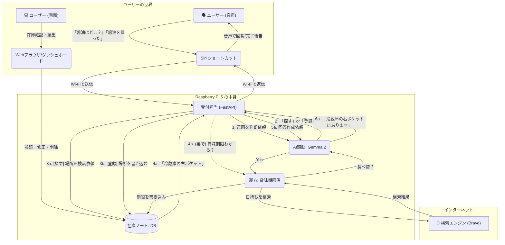

```mermaid
graph TD
    subgraph UserLayer ["ユーザーの世界"]
        UserVoice["🗣️ ユーザー (音声)"] -- "「醤油はどこ？」「醤油を買った」" --> Shortcuts("Siri ショートカット")
        UserWeb["💻 ユーザー (画面)"] -- "在庫確認・編集" --> Browser("Webブラウザ/ダッシュボード")
    end

    subgraph Cloud ["インターネット"]
        Search["🦁 検索エンジン (Brave)"]
    end

    subgraph PiLayer ["Raspberry Pi 5 の中身"]
        API["受付担当 (FastAPI)"]
        AI("AI頭脳: Gemma 2")
        DB[("在庫ノート: DB")]
        Worker("裏方: 賞味期限係")

        %% Dashboard Flow
        Browser -- "参照・修正・削除" --> DB
    end

    %% Flow 1: Voice Input
    Shortcuts -- "Wi-Fiで送信" --> API
    API -- "1. 意図を判断依頼" --> AI
    AI -- "2. 「探す」or「登録」" --> API

    %% Branch A: Query (Search)
    API -- "3a. [探す] 場所を検索依頼" --> DB
    DB -- "4a. 「冷蔵庫の右ポケット」" --> API
    API -- "5a. 回答作成依頼" --> AI
    AI -- "6a. 「冷蔵庫の右ポケットにあります」" --> API

    %% Branch B: Add (Register) & Background Task
    API -- "3b. [登録] 場所を書き込む" --> DB

    %% Async Flow (Dotted lines)
    API -. "4b. (裏で) 賞味期限わかる？" .-> Worker
    Worker -- "食べ物？" --> AI
    AI -- "Yes" --> Worker
    Worker -- "日持ちを検索" --> Search
    Search -- "検索結果" --> Worker
    Worker -- "期限を書き込み" --> DB

    %% Return to User
    API -- "Wi-Fiで返信" --> Shortcuts
    Shortcuts -- "音声で回答/完了報告" --> UserVoice
```
